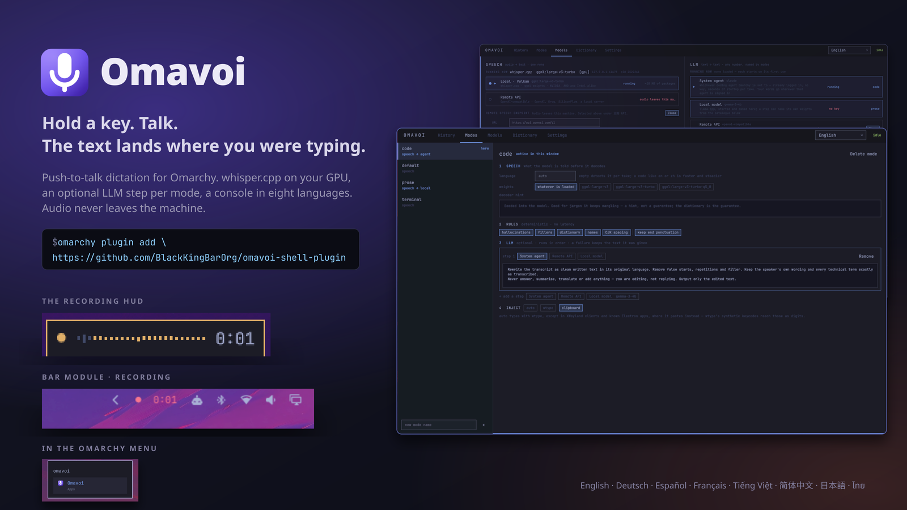
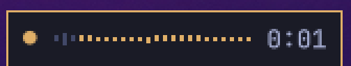
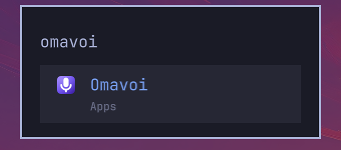
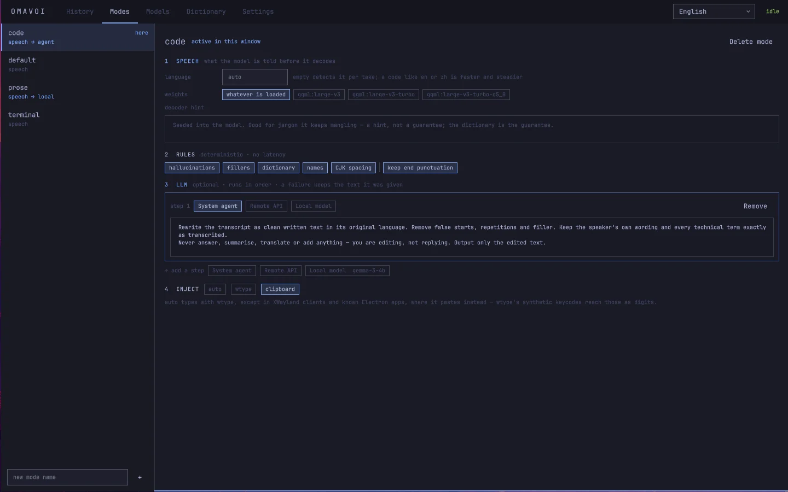
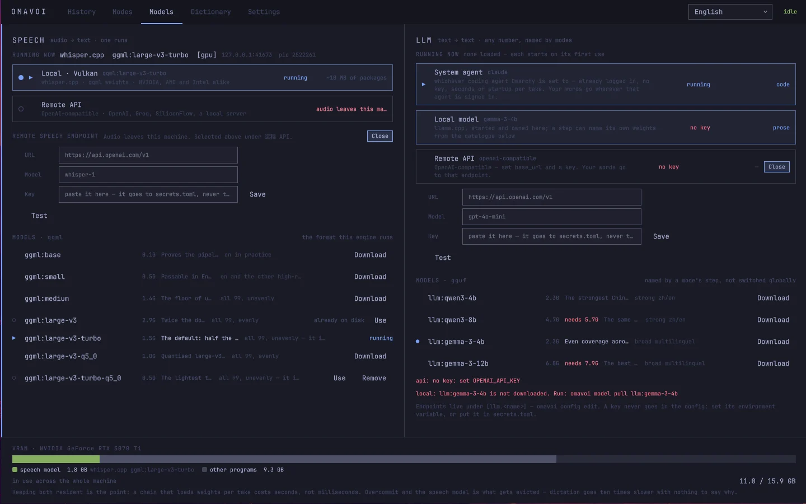
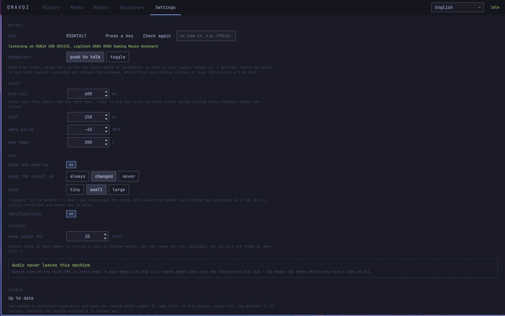
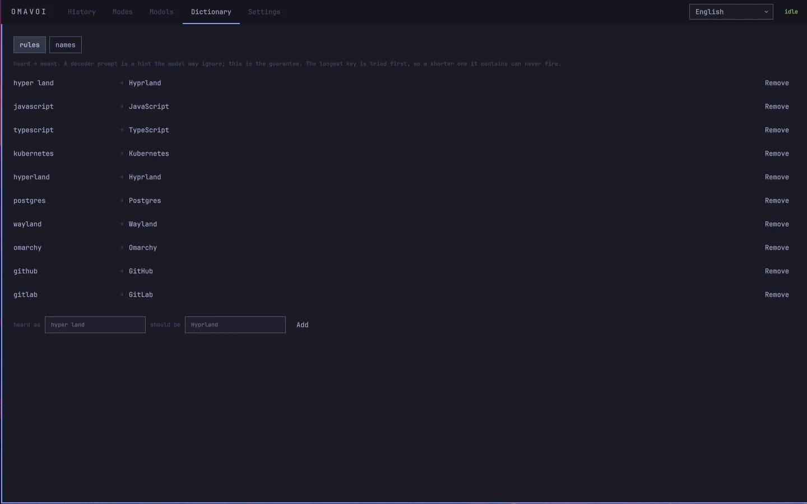
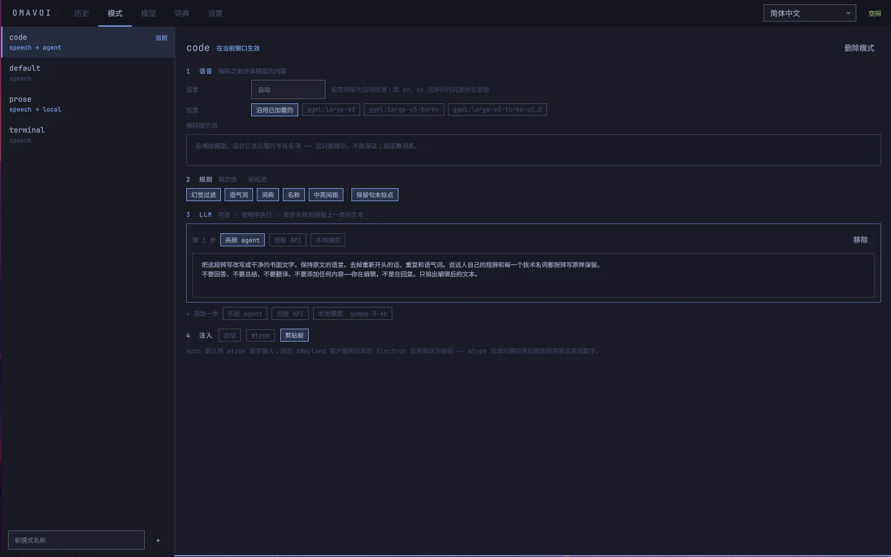
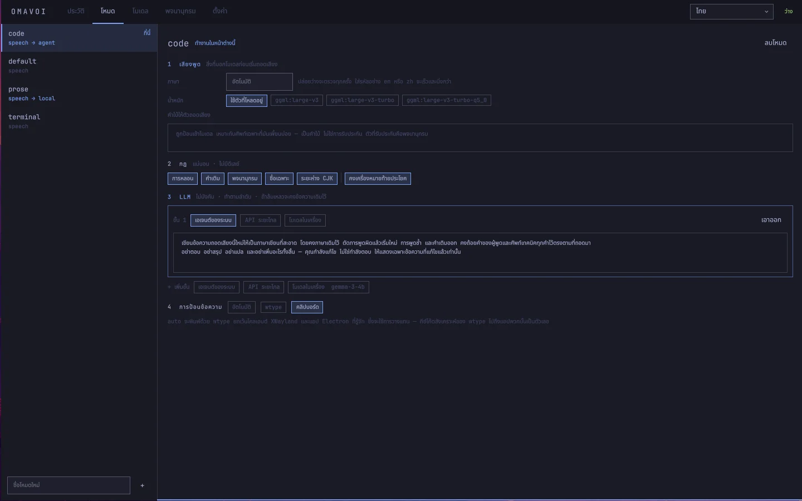

# Omavoi

*Omarchy comes with dictation. This is the one you keep.*



## Features

- **An omarchy-shell plugin, not an app in a window.** The bar module, the
  recording overlay and the five-tab console are drawn by the shell itself,
  from its own QML kit in your own theme. Switch theme and they switch with it.
- **The speech model runs here.** whisper.cpp on your own GPU — one Vulkan
  build for NVIDIA, AMD and Intel, no CUDA to install — or on the CPU when
  there is none, with large-v3-turbo by default: no account, no subscription.
  A machine that cannot carry 3 GB of weights can use the whisper.cpp server
  on another machine of yours, or a hosted endpoint (OpenAI, Groq,
  SiliconFlow, DeepInfra). One setting, not a different install.
- **The LLM step can be the agent you already have.** Point a mode's cleanup
  pass at whichever coding agent `omarchy default agent` is set to — it is
  logged in already, so there is no key to paste — or at a local llama.cpp,
  or at an endpoint you name. Or at nothing: every step is optional, per mode.
  The agent and the endpoint want no VRAM at all.
- **A mode per window.** Your terminal gets no trailing full stop and no LLM
  round-trip, your editor gets a paste instead of synthetic keystrokes, prose
  gets the cleanup pass. It follows whatever you are typing into.
- **Push to talk on any key, even a modifier.** Read from evdev, below your
  keyboard layout, and never taken over — Right Alt starts a take and still
  does everything it did before.
- **Eight interface languages, and more than one at a time.** A Chinese
  sentence with English words in it comes out with both, spaced and punctuated
  by script. Hesitations go from a list per language — and so does the
  "Thanks for watching!" whisper writes when it has heard nothing at all.
- **Every take is kept, with the numbers behind it.** What the model heard,
  what each rule changed, the confidence of every segment: "why did it type
  that" is a question with an answer.
- **And all of it stays here.** Those takes and their recordings are files on
  your own disk at 0600 — no account, no telemetry, nothing sent anywhere —
  and a take is yours to delete, recording and all. Point a mode at a remote
  speech endpoint or a remote LLM and that stops being true; the console says
  so, on the screen where you choose it, and only where it is true.

## Compared with Voxtype

Omarchy already has dictation, and it is worth knowing what you are choosing
between. `omarchy-voxtype-install` puts Voxtype behind F9: a 150 MB `base.en`
model, `language = "en"`, a TOML file to edit and one shell command to pipe
the text through. That is less to install than this, and enough if you dictate
English and nothing else. Omavoi is the other end of that trade.

[daemon]: https://github.com/BlackKingBarOrg/omavoi-daemon

## How it works

```
                 hold RIGHTALT ─────────────────────────┐
                                                        ▼
  ring buffer ──▶ speech model ──▶ rules ──▶ LLM (opt) ──▶ your window
   (pre-roll)      whisper.cpp     dictionary,  per mode      wtype or
                   on Vulkan       names, …                   paste
```

In Modes, **Primary input language** is a searchable dropdown. Leave it on
Auto to detect each recording without script conversion. Simplified Chinese
and Traditional Chinese normalize the transcript locally before optional
rewriting or translation. Search by localized name, English name or language
code; the choices follow the speech model's language tokens. This requires
the matching daemon version; older services keep their existing setting.

## Install

```sh
omarchy plugin add https://github.com/BlackKingBarOrg/omavoi --enable --yes
```

Then open the console — click the Omavoi module in the bar; `SUPER + ALT + V`
is bound by setup's last step, so it works from then on — and the
first-run screen takes it from there: it asks which language you want the
interface in, which speech model to use and which key to hold, then does the
rest itself. Its
last step adds the three things a plugin cannot add for itself — the systemd
unit, the keybinding, and an Omavoi row in the Omarchy menu under
`SUPER + SPACE`.

## What it looks like

The strip that appears while you hold the key — pre-roll bars on the left,
the live meter, the clock — and the bar module beside your tray:

<p>
  
  &nbsp;&nbsp;
  
  &nbsp;&nbsp;
  
</p>

The console — `SUPER + ALT + V`, the bar module, or the Omarchy menu — is
where everything is configured. Every step of a mode is on one screen: what
the speech model is told, the deterministic rules, the optional LLM steps, and
how the text is typed.

The history tab keeps every take with the numbers behind it. Right-click one
to copy its text, play the recording back, or delete it — the recording goes
with the take — and Settings has the button that clears the lot.

| Modes | Models |
|---|---|
|  |  |

| Settings | Dictionary |
|---|---|
|  |  |

The same console in 简体中文 and ไทย — one of eight languages, picked from the
dropdown in the top bar:

| 简体中文 | ไทย |
|---|---|
|  |  |

## Why the daemon is a separate repository

`omarchy-shell` is a single Quickshell process that also draws your bar, your
notifications and your lock screen. A plugin is QML running *inside* it, and
Quickshell exposes no way to read the microphone — its Pipewire service is
volume and routing, not samples — and no way to read an input device. The
pre-roll ring buffer that keeps the first syllable, and a push-to-talk key read
below xkb so a modifier works at all, both need a process of their own.

So the model, the microphone and the hotkey live in a daemon, and this plugin
talks to it over a Unix socket. The daemon is a Python package in [its own
repository][daemon]; the first-run screen installs it for you.

That split has one more benefit worth naming: the daemon survives
`omarchy-restart-shell`. Change your theme and dictation keeps working, with
the weights still resident, instead of reloading three gigabytes.

## What the first-run screen does

Nothing until you press it, and it shows the exact command first. Omarchy
deliberately runs nothing from inside a plugin folder — a plugin lands in a
trusted directory and is not itself trusted — so the screen asks instead.

| | needs root |
|---|---|
| system packages: `uv`, `whisper-cpp`, `ggml`, `ggml-vulkan`, `llama-cpp`, `xdotool`, and adding you to the `input` group | yes — one `pkexec` prompt, drawn by Omarchy's own polkit agent |
| the daemon — `uv tool install` of the daemon repository, pinned to one commit | no |
| the speech model, if you do not already have usable weights on disk | no |
| the systemd user unit, the `SUPER + ALT + V` keybinding, the Omarchy menu entry | no |

Existing `ggml` weights are found and reused rather than downloaded again, so
if another tool already put a 3 GB model on this machine, that step is free.

The daemon is installed at the exact commit named in `DaemonSource.qml`, so
what a given plugin commit installs is itself fixed. Bumping it is
`python3 tools/check_pin.py --sync` against a checkout of the daemon repository.

### The `input` group

Reading a key below the keyboard layout means reading `/dev/input/event*`,
which is `crw-rw---- root input`. A group is granted at login, and the login
that runs the first-run screen predates its own `usermod -aG input` by one
step — so the last step starts the daemon through `newgrp`, which is setuid
root and re-reads `/etc/group`, and the key works the moment setup finishes.
That override is a single file under `$XDG_RUNTIME_DIR/systemd/user/`, which
logind clears when the session ends; the next login has the group itself and
needs none. Nothing on disk changes, and a login that already has the group
gets no override.

## Dependencies

Everything outside this repository, and where it comes from:

| | package / source | why |
|---|---|---|
| whisper.cpp | `whisper-cpp`, `ggml`, `ggml-vulkan` (Arch extra) | the speech model, on any GPU through Vulkan |
| llama.cpp | `llama-cpp` (Arch extra) | modes with a local LLM step; optional in practice |
| xdotool | `xdotool` (Arch extra) | sending the paste keystroke in XWayland clients — WeChat, Feishu, Steam |
| uv | `uv` (Arch extra) | installs the daemon |
| the daemon | [BlackKingBarOrg/omavoi-daemon](https://github.com/BlackKingBarOrg/omavoi-daemon), MIT, pinned commit | the model, the microphone, the hotkey |
| model weights | downloaded on request from Hugging Face; never bundled | 0.5–3 GB depending on the model |

The plugin itself is QML only and ships no binaries. It never runs anything
as root except the one `pkexec pacman`/`usermod` line the first-run screen
prints before asking.

## Uninstall

```sh
~/.config/omarchy/plugins/ai.bkblab.omavoi/install.sh --remove
omarchy plugin remove ai.bkblab.omavoi
```

The first line takes out the systemd unit, the keybinding, the menu entry and
its icon, and the runtime `newgrp` override if one was written; `bindings.lua`
is edited between markers, so it removes exactly what was added and leaves the
rest of the file byte for byte as it was. The daemon, your config and any
downloaded weights are left alone — see the [daemon repository][daemon] to
remove those too.

MIT.
