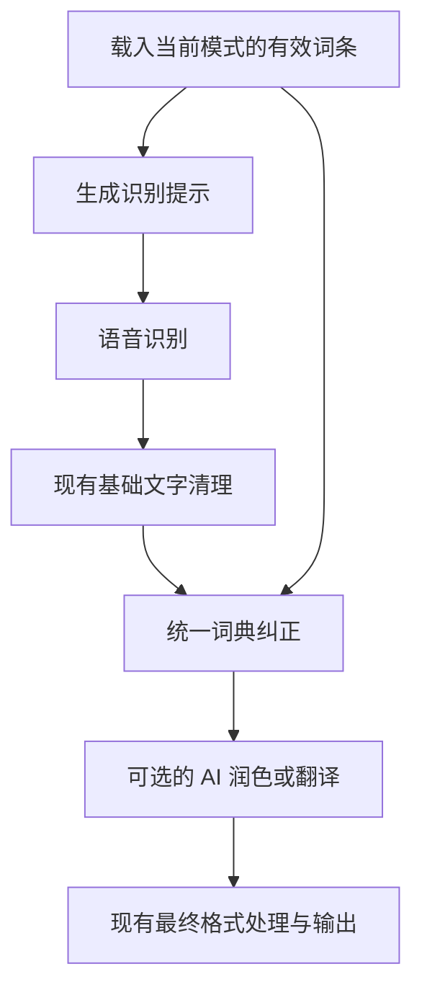

# 让 Omavoi 写对你的词：「我的词典」设计方案

状态：用户已授权实施；实现与验证说明见末尾。日期：2026-09-19。

面向读者：产品负责人、体验评审者、前后端开发者。

本文先说明普通用户会看到什么，再说明数据、处理流程和迁移方式。下文保留设计依据；本次实施范围、验证结果和差异见末尾。

## 1. 本次设计要解决什么

用户的需求是：“这个词总被写错，我希望以后写成这样。”

当前产品要求用户先区分 Rules 和 Names，再决定填写错误写法还是正确名字，还会看到 seed only、matching、Dry run 等实现术语。这些区别对程序有意义，对大多数用户没有帮助。

本次建议：用一个「我的词典」页面、一种添加流程和一种词条数据，承接现有两种能力。

- 平时只填写希望输出的词语，例如 JavaScript、林晓彤、星河设计。
- 如果某个错误反复出现，再为这个词补充“经常写成什么”。
- 用户不再创建或管理名为 Rule、Name 的对象。
- 保留明确替换的能力；自动处理简单大小写差异。
- 发音纠正属于可选能力，默认关闭，不成为添加词语的前置步骤。

**核心验收问题：第一次打开页面的人，能否在没有解释的情况下添加一个词，并知道它还写错时该怎么处理？**

### 本次范围

包含：页面名称、列表、添加与编辑、大小写处理、固定错误纠正、词条数据、命令接口、模式开关、旧配置迁移、错误提示和验收标准。

不包含：重新训练模型、改进发音算法、自动学习用户改字、云同步、团队词典、短语展开产品、批量导入、整套设置页面重做。历史记录里的“一键加入词典”可作为后续功能，不阻塞本次上线。

## 2. 已确认的现状与参考

### 2.1 当前项目

检查基线：界面仓库 `9029082`，后端仓库 `5e8d6bf`。下面描述的是这个基线，不表示未来实现已经完成。

| 层面 | 当前 Rules | 当前 Names |
| --- | --- | --- |
| 用户输入 | 错误写法和正确写法 | 正确名字 |
| 存储 | `dictionary.rules`，字符串映射 | `dictionary.names`，词条列表 |
| 操作入口 | `omavoi dict` | `omavoi names` |
| 识别前 | 不提供提示 | 在预算允许时提供识别提示 |
| 识别后 | 程序按文字匹配替换，不区分大小写 | 可选的发音匹配与替换 |
| 默认状态 | 内置多条规则 | 默认列表为空，新名字默认关闭发音匹配 |
| 模式控制 | `rules.dictionary` | `rules.names` |

默认规则已经包含 `javascript → JavaScript`、`github → GitHub` 和 `hyper land → Hyprland`。因此重构还涉及已有默认行为，不能只考虑用户新加的内容。

目前的处理顺序是：Names 提示 → 语音识别 → 文本清理与 Rules 替换 → Names 发音纠正 → 可选的 LLM 处理 → 输出。

需要特别留意：

- Rules 按键长度降序逐条执行，前一条结果会成为后一条输入，存在连锁替换。
- Rules 对部分 ASCII 键使用词边界；中文及带部分标点的键走不同的匹配路径。
- Names 的发音匹配不能等同于可靠的大小写统一。
- 当前 Names 添加框按空白拆分输入，无法直接表达带空格的完整词组。
- 当前匹配启用操作面向整份 Names 列表，粒度过大。
- 可选的 LLM 位于这些处理之后，仍可能改写已经纠正的文字。
- `post.enabled` 和模式开关共同影响实际行为，迁移时不能遗漏。

### 2.2 竞品参考及其边界

Wispr Flow 的 Dictionary 既能添加词汇，也能通过 Correct a misspelling 填写固定错误；其桌面纠正匹配忽略大小写，保留指定输出写法。[官方词典说明](https://docs.wisprflow.ai/articles/4052411709-teach-flow-your-words-with-the-dictionary)

Superwhisper 的 Vocabulary 同时包含识别词汇和 Replacements。官方说明替换在识别后由程序执行，两者共用界面。[官方 Vocabulary 说明](https://superwhisper.com/docs/get-started/interface-vocabulary)

查阅日期：2026-09-19。以上依据公开文档，未在它们的所有平台和版本上实机验证。这里借鉴的是“一个入口，同时容纳词汇和纠正”的思路，不假定它们的后端结构或发音算法与本项目相同。

**产品判断：替换能力有实际用途；当前需要简化的是用户理解和操作这项能力的方式。**

## 3. 命名：用户先理解目的，再看到选项

### 3.1 推荐的名称体系

| 位置 | 中文定稿建议 | 英文建议 | 说明 |
| --- | --- | --- | --- |
| 导航与页面标题 | 我的词典 | My dictionary | 两处保持一致，突出用户自己的词 |
| 页面说明 | 添加人名、公司名或专业词语，帮助 Omavoi 写对它们。 | Add names and specialized words to help Omavoi spell them correctly. | 说明用途，不承诺百分之百正确 |
| 主按钮 | 添加词语 | Add word | 一个明确动作 |
| 添加窗口标题 | 添加词语 | Add word | 不另造“新建词条”等术语 |
| 编辑窗口标题 | 编辑词语 | Edit word | 和添加保持同一概念 |
| 主要输入框 | 希望怎么写 | Preferred spelling | 从输出结果出发 |
| 展开可选字段 | 经常写错？ | Keeps getting it wrong? | 按用户遇到的问题组织 |
| 可选输入框 | 经常写成什么 | What does Omavoi write instead? | 指 Omavoi 实际输出，不是用户的发音 |
| 添加另一种错误 | 再加一种写法 | Add another spelling | 一个词允许多个已知错误 |
| 保存动作 | 保存 | Save | 不区分添加规则/添加名字 |
| 词条高级选项 | 更多选项 | More options | 默认折叠 |
| 模式开关 | 使用我的词典 | Use my dictionary | 一个用户可理解的主开关 |

“词语”包括人名、缩写和含空格的词组，不局限于语言学意义的单个单词。输入框下明确注明“可以包含空格，例如 Visual Studio Code”。

### 3.2 为什么不用其他名称

| 候选 | 不采用的原因 |
| --- | --- |
| Rules / Names、规则 / 名称 | 无法预测用途；把内部机制当成用户分类 |
| 专有名词 | 用户可能认为普通词、缩写或固定写法不能添加 |
| 自定义词典 | 可以理解，但语气偏设置项；「我的词典」更贴近个人使用 |
| 识别纠错 | 像故障诊断入口，不容易联想到提前添加名字 |
| 常用语 | 容易被理解为整段短语或快捷回复 |
| 智能词库、精准识别 | 含糊且容易夸大效果 |

“我的词典”是推荐方案，尚未经用户测试证明优于所有候选。评审时应用第 13 节的任务测试验证，不能只凭开发者投票决定。

### 3.3 文案原则

1. 先说用户要做什么，再解释系统会怎样帮助。
2. 优先使用“写成”“词语”“保存”等日常用语。
3. 不把模型、提示词、拼音键、匹配阈值或 token 放入基本操作。
4. 不显示“保证正确”“训练完成”“已经学会”等超出实际能力的表述。
5. 同一对象始终叫“词语”，同一动作始终叫“保存”。
6. 默认示例覆盖人名、公司名与技术词，不能整页只有程序员术语。

## 4. 页面与交互设计

### 4.1 词典列表

```text
我的词典                                      [添加词语]
添加人名、公司名或专业词语，帮助 Omavoi 写对它们。

[搜索词语或写错的内容…                              ]

词语               需要纠正的写法                   操作
JavaScript         —                              编辑  ⋯
星河设计           星合设计                        编辑  ⋯
林晓彤             林小童、林晓童                   编辑  ⋯
Visual Studio Code —                              编辑  ⋯
```

这是一份低保真信息结构示意，不规定最终字体、间距与颜色。视觉实现沿用项目主题，但主要按钮必须有清晰的按钮样式，不与说明文字混淆。

- 不设 Rules / Names 分页，不显示类型列。
- “需要纠正的写法”为空时用短横线，不把“还没有规则”显示成问题。
- 搜索同时覆盖正确写法和错误写法，忽略大小写。
- 默认按最近修改排序，使用存储的顺序信息而非声称尚未准确统计的使用频次。
- 刚保存的词语可见并短暂高亮；搜索条件隐藏它时给出清除搜索入口。
- 点击词语或“编辑”打开同一编辑窗口；更多菜单放“暂停使用 / 恢复使用”和“删除”。
- 暂停的词语显示文字状态“已暂停”，不能只依靠颜色。
- 错误写法较多时显示前两项和“另有 N 项”；编辑窗口可查看全部。
- 小窗口改成两行布局，让词语与操作仍可访问；不依靠悬浮提示读取关键内容。

### 4.2 添加：只填一个框就能完成

```text
添加词语

希望怎么写
[林晓彤                                          ]
填写完整名字或词语，也可以包含空格。

▸ 经常写错？
▸ 更多选项

                                  [取消] [保存]
```

默认不要求用户选择类别、语言、模型、纠正方式或生效模式。保存后关闭窗口，列表更新，提示“已添加「林晓彤」”。不强制用户试读或查看预览。

添加 `JavaScript` 时，同一个词的大小写差异由系统自动处理，用户不需要再登记 `javascript`。

### 4.3 针对反复出现的错误，补充写法

```text
编辑词语

希望怎么写
[林晓彤                                          ]

▾ 经常写错？
经常写成什么
[林小童                                          ] [移除]
[林晓童                                          ] [移除]
[再加一种写法]

以后写出这些内容时，会改成「林晓彤」。
只填写你希望始终改掉的写法。

▸ 更多选项
                                  [取消] [保存]
```

错误写法逐项录入，不按空格、逗号或其他标点隐式拆分。空白的可选行可忽略；非空但非法的行必须就地提示。已存在错误写法的词语，编辑时自动展开本节。

正确写法一旦编辑，所有错误写法的目标随同更新，不留下旧目标。预览文字实时更新，但只有保存后才改变实际配置。

### 4.4 更多选项

| 用户看到的选项 | 新词默认值 | 可见条件与解释 |
| --- | --- | --- |
| 帮助识别这个词 | 开 | 允许迁移来的纯替换词继续关闭；说明“把这个词提供给语音识别服务，帮助它识别” |
| 使用这里的大小写 | 开 | 仅对有大小写字符的词显示；例子随当前词变化 |
| 纠正发音相近的写法 | 关 | 说明“也可能改动原本正确的词，建议先查看效果” |
| 应用于 | 所有模式 | 原有范围限制在这里管理；不要求新用户设置 |

说明“帮助识别”时，不暗示词语仅在本地处理：使用云端语音服务时，词语可能随请求发送给该服务。这条说明紧邻相关选项，不新增一套授权流程。

发音纠正开启后，该词条详情提供“查看纠正效果”。预览使用选定模式下的完整纠正流程，以这个选项开关前后的差异为结果；不直接拿原文只跑一次发音算法。可使用已有记录或粘贴一段文字，无记录也能预览。结果不修改历史记录，不发送到当前输入框。

无预览样本时显示“还没有可预览的文字”，不能声称“没有误改”。保存仍由用户决定，不设“看过预览才能启用”的隐藏门槛。此处是词条级开关，不再一键启用整个词典的发音纠正。

### 4.5 空状态、错误状态和删除

| 场景 | 建议文案 / 行为 |
| --- | --- |
| 没有词语 | “把经常写错的名字或词语加到这里。”按钮“添加第一个词语” |
| 搜索无结果 | “没有找到相关词语。”可清除搜索或添加词语 |
| 正确写法为空 | “请填写希望输出的名字或词语。” |
| 同范围已有相同词语 | “已有「JavaScript」。”提供“编辑已有词语”，保留当前草稿 |
| 错误写法与正确写法相同 | “这个写法已经正确，不需要重复添加。” |
| 只有大小写不同 | “大小写会自动统一，无需重复添加。”若该选项关闭，则提示开启或保留明确纠正 |
| 一个错误写法指向两个目标 | “「星合」已经设置为改成「星河设计」。”提供查看原词语入口 |
| 保存失败 | “未能保存，请重试。”保留所有输入，详情提供实际原因 |
| 已保存但服务未载入 | “已保存，暂未生效。”提供“重试”，不能显示普通成功提示 |
| 读取失败 | 显示“暂时无法读取词典”和重试，不伪装为空词典 |
| 删除后 | “已删除「林晓彤」。”提供“撤销” |

单条删除可逆：成功后保留本次会话的撤销数据，直到下一次词典修改或关闭页面。删除一个词语同时删除其错误写法；菜单说明这一点。撤销遇到并发冲突时不覆盖新数据，转为恢复冲突提示。首版不提供批量删除。

键盘要求：Tab 顺序可预测，Enter 在主要输入框中提交，在错误写法输入框中确认该项；Escape 在未修改时关闭，已修改时询问是否放弃草稿。按钮和状态都有可读标签，不能仅靠图标或颜色。

## 5. 用户可感知的行为约定

### 5.1 什么能自动完成

| 添加内容 | 识别结果 | 期望结果 | 前提 |
| --- | --- | --- | --- |
| JavaScript | javascript | JavaScript | 开启大小写统一，命中完整词 |
| JavaScript | JAVASCRIPT | JavaScript | 同上 |
| JavaScript | JavaScriptCore | JavaScriptCore | 不替换较长词内部的片段 |
| JavaScript | javascript_utils | javascript_utils | 不改标识符内部片段 |
| Visual Studio Code | visual studio code | Visual Studio Code | 空格属于词组，按整体匹配 |
| 星河设计；错误写法为星合设计 | 联系星合设计 | 联系星河设计 | 明确的错误写法生效 |
| 林晓彤；未配置错误写法 | 林小童 | 不保证纠正 | 识别提示不等于文字替换；发音纠正默认关闭 |
| 林晓彤；错误写法为林小童 | 联系林小童 | 联系林晓彤 | 明确纠正生效 |

大小写统一不是语义判断。添加 `US` 并开启此功能，可能把独立单词 `us` 改成 `US`。当保存纯字母且不超过三个字母的全大写词时，在表单中明确展示例如 `us → US` 的结果，并允许关闭。长词也不宣称绝无歧义。

### 5.2 识别提示的真实状态

模型是否支持提示、提示容量是否足够，影响的是识别前帮助；不应关闭明确的文字纠正。

正常列表不显示预算数字。仅在有实际限制时显示可操作的说明，例如“当前语音服务无法使用词语提示；已设置的文字纠正仍会生效”。容量不足时说明“部分词语本次未用于帮助识别”，详情列出词语，不能把它们统一标成“已启用提示”。

识别服务适配层需要提供能力与预算信息。保留当前有效预算机制作为第一版起点，不把 224 写死为所有模型通用限制；token 是诊断信息，不是用户必须配置的参数。

## 6. 统一的数据模型

### 6.1 一份持久化数据

推荐新的权威数据为 `dictionary.entries`，示意如下。示例使用 JSON 展示结构；项目继续使用既有配置文件格式，不为此引入数据库或新的配置格式。

```json
{
  "dictionary": {
    "schema_version": 2,
    "revision": 1,
    "entries": [
      {
        "id": "word_hyprland",
        "text": "Hyprland",
        "aliases": ["hyperland", "hyper land"],
        "enabled": true,
        "recognition_hint": true,
        "normalize_case": true,
        "phonetic": {"enabled": false, "method": "auto"},
        "modes": [],
        "updated_at": "2026-09-19T08:00:00Z"
      }
    ]
  }
}
```

`id` 示例是便于阅读的占位值，实际生成不依赖名称的随机稳定 ID。编辑名称不能改变 ID。`revision` 用于防止并发覆盖；`updated_at` 用于排序，不被当成识别质量或词频。

| 字段 | 含义与约束 |
| --- | --- |
| `text` | 正确输出，去除首尾空白，保留内部空格、标点与大小写 |
| `aliases` | 明确的错误输出；不是同义词、发音标注或正则表达式 |
| `enabled` | 暂停后该词所有作用停用 |
| `recognition_hint` | 是否请求为支持的识别模型提供此词；不代表一定进入每次提示 |
| `normalize_case` | 是否统一此词大小写，与发音匹配独立 |
| `phonetic.enabled` | 发音纠正开关，默认关闭 |
| `phonetic.method` | `auto` 或迁移保留的已有方法；不在主界面暴露 |
| `modes` | 生效的模式 ID；空列表表示所有模式 |

新建普通词语的默认值：启用、帮助识别和大小写统一打开；发音纠正关闭；应用于所有模式。文字纠正不依赖 `recognition_hint`。

从旧数据迁移时，可以附带 `legacy_metadata` 保存当前尚不在界面展示的分组、来源等信息；不得让这个字段重新变成第二份可编辑的规则集合。发音阈值、语言算法设置等现有全局参数先保留在统一词典的内部设置中，不因重命名丢弃。

### 6.2 不落盘的派生信息

从词条生成识别提示、精确匹配索引和发音索引。以下内容属于运行状态或日志，不与用户输入混为一谈：

- 发音键、大小写比较键、匹配缓存。
- 本次提示是否入选、未入选的原因、服务是否支持。
- 某次纠正的 before / after、词条 ID 和命中原因。
- 暂存的预览结果。

前端接收这些状态来显示反馈，但不直接计算它们。不在保存词语时要求前端同步维护 `rules` 和 `names`。

### 6.3 输入与冲突校验

新建数据使用 Unicode NFC 规范化用于比较；大小写比较使用明确的 Unicode 规则，并维护比较文本到原文位置的映射。禁止在规范化字符串上得到位置后直接切原文。不要为图方便把 NFKC 转换强加给所有用户输出。

新词和每条错误写法建议限制为 200 个 Unicode 码点；允许短词组和 `C++`、`.NET` 等形式，拒绝空字符串、换行、控制字符和纯空白。明确替换里的符号按字面量处理，不能被解释为正则表达式或命令。超长或特殊旧规则走迁移例外，不截断。

在作用范围重叠时：

- 相同规范化正确写法不能重复创建；提示编辑已有词语。
- 开启大小写统一后，不能同时建立 `iOS` 与 `IOS` 两种互相竞争的目标。
- 同一错误写法不能指向不同目标。
- 一个词的错误写法不能吞掉另一个已登记的正确写法；提示用户缩小范围或修改内容。
- 同一词内重复错误写法去重，并在保存前反映在表单中。
- 发音候选并列且无法区分时不自动替换，不靠列表顺序猜测。

作用范围确实互斥时允许相同输入对应不同目标，并在详情里显示范围。模式列表变化后重新验证有效配置；已经无法解析的模式 ID 不自动退回“所有模式”。

## 7. 处理流程：统一入口，行为可解释

### 7.1 第一版明确保留处理位置



**第一版不增加润色后的第二轮词典替换。** 这是对前期讨论的收敛：第二轮可能把翻译结果改回原文，也会重新触发另一条规则；把它和界面重构捆绑，会增加难以验证的行为变化。

因此第一版承诺的是“在词典处理阶段完成纠正”，不承诺后续任意 AI 步骤永远保持结果。将来若做“润色后保留指定写法”，必须作为独立模式能力评审，并处理翻译和重复应用问题。历史诊断应区分词典输出和 AI 最终输出。

统一纠正函数建议返回文本及结构化变更记录；实时识别、文件转写、重新处理历史和预览尽量共用该入口。预览只运行必要的本地文本步骤，不为查看替换效果额外调用云端模型。

### 7.2 一次纠正的匹配规则

1. 在未修改的输入上收集所有候选及区间。
2. 保护已完整命中的正确写法，避免随后发音纠正改坏它。
3. 选择明确错误写法和大小写统一候选；相同优先级下，较长的完整匹配优先，再按起始位置排序。
4. 两类候选范围相交时，明确错误写法优先于大小写统一；保存校验应提前排除会吞掉已登记正确词的冲突。
5. 发音匹配仅作用于未被保护、未被明确纠正占用的区域，优先级最低。
6. 在原文本坐标上一次性生成结果，不对替换后的字符串递归匹配。

新数据中涉及目标继续触发其他规则的链或环，保存时拒绝并指出冲突。包含关系也要校验：某个替换目标内部含有其他触发词时，同样可能产生跨次变化。算法上线前需用性质测试确认有效配置下的重复调用稳定性；不能只检查两个目标完全相等的简单链。

### 7.3 字符边界

- 拉丁字母、数字、下划线和组合标记构成词内部边界，防止修改 `javascript_utils` 等标识符片段。
- 中文紧邻英文时，中文不阻止命中完整英文词，例如 `用javascript开发` 可得到 `用JavaScript开发`；是否增加空格仍由现有排版功能负责。
- 中文明确错误写法允许在连续汉字中按完整字符串匹配；这不代表理解了中文词义。
- 带符号的词使用字面量与相邻字符规则，不能把 `C++`、`.NET` 直接包在通用 `\b` 中。
- 大小写统一不自动删除空格或标点；`java script` 要变成 `JavaScript`，需要明确写法或另外开启的发音能力。
- 首版不声称支持所有语言的发音纠正；没有对应方法时返回“不支持”，保留识别提示和明确纠正。

### 7.4 记录与解释

每次变更记录词条 ID、原文字、输出文字、原文区间和原因：明确错误、大小写或发音。用户详情使用“已将「林小童」改成「林晓彤」”，技术字段仅用于诊断。

变更记录遵守现有历史保存设置；不为这个功能新增长期保存用户文本的副本。发音命中分数不作为普通用户必须理解的指标。

## 8. 模式与兼容行为

新建模式只有“使用我的词典”一个总开关；关闭时不使用任何词条提示或纠正。词条的适用模式在其更多选项中设置。

旧配置可能只启用 Rules 或只启用 Names；`post.enabled` 还可能只影响其中一部分。不能通过简单 OR / AND 合并来声称完全兼容。

建议后端在兼容期保留按能力生效的模式掩码，由旧配置计算得到；它是模式兼容信息，不是另一份词条。普通新模式使用统一开关。旧模式若各能力状态不同，界面显示“词典：部分启用”，并提供“查看现有设置”。

用户选择“全部启用”或“全部关闭”后才转为新的统一状态。详情显示日常语言的能力名称，不继续要求用户理解 Rules / Names。`post.enabled` 的历史作用同样纳入迁移报告，不在这次改动中悄悄重定义。

## 9. 命令与前后端接口

新界面只调用统一接口。建议增加 `omavoi vocabulary` 命令族，避免改变现有 `dict add <heard> <meant>` 的参数含义。

| 操作 | 建议接口 | 要点 |
| --- | --- | --- |
| 读取 | `vocabulary list --json` | 返回版本、revision、词条及运行状态 |
| 创建 / 编辑 | `vocabulary save --json-input` | 通过 stdin 传结构化草稿和期望 revision，返回保存后的词条 |
| 删除 | `vocabulary remove <id> --revision <n>` | 按 ID 操作，返回可供撤销的词条快照 |
| 预览 | `vocabulary preview --json-input` | 输入草稿、文本和模式，返回前后差异；不写配置 |

名称和参数是设计建议，实施时可按项目 CLI 习惯调整，但结构化输入、稳定 ID、并发检查、无 shell 拼接是必要约束。前端必须通过 argv/stdin 传用户文字。

保存先做全量校验，再加锁检查 revision，原子写入配置，通知运行服务重新载入。返回值区分“已保存且生效”与“已保存但未载入”；服务未启动时保存允许成功，并说明下次启动生效。进行中的一次转写使用开始时的完整配置快照，避免前后阶段混用两个版本。

旧命令暂保留为适配入口，避免脚本立刻失效；新增能力以新命令为准。旧 JSON 输出的字段形状在兼容期保留，弃用提示只写 stderr，不能污染 stdout JSON。

- `dict add` 为统一词条补充明确错误写法，不擅自开启识别提示。
- `dict rm` 只移除指定错误写法，不删除同一词语的其他能力。
- `names add` 启用或创建该词的提示用途，不重复创建相同词语。
- `names rm` 关闭原 Names 对应的提示和发音用途；保留旧 Rules 对应的明确纠正。
- 仅当词条已没有任何有效用途时，兼容删除才能删除整个对象。

兼容投影需要保留来源元数据，使原大小写规则和 Names 用途可区分；这份元数据只服务迁移和旧命令，不展示成两个用户分类。无法无歧义完成旧命令时返回明确错误，引导使用新命令，不猜测删除整个词条。

## 10. 迁移方案：简化操作，不静默改变既有结果

### 10.1 总体约束

迁移必须版本化、可备份、可回退、可重复运行。不得同时维护两套可编辑的权威数据。正常迁移后只读写 `entries`，旧数据只留在备份中。

不能从“输出词相同”直接推断两个旧对象可以无损合并。是否合并还取决于作用范围、开关、大小写和当前替换顺序。

### 10.2 可以自动处理的常见情况

| 旧数据 | 迁移结果 |
| --- | --- |
| 只有 Name | 建立词条，保留提示、发音和范围；不额外开启旧配置没有的大小写纠正 |
| 只有普通 Rule | 目标变成正确写法，源变成错误写法；提示和发音默认关闭 |
| 多条 Rule 指向同一目标 | 在范围与行为兼容时合为一个词条，保留所有错误写法 |
| Name 和 Rule 目标相同 | 能证明范围与行为一致时合并，保留各项能力状态 |
| 纯大小写 Rule | 仅在大小写比较与边界行为等价时转成大小写选项，否则保留显式写法 |
| 旧分组或暂未暴露的参数 | 保留在迁移元数据或对应内部设置，不直接丢弃 |

上述保守默认值与“新建词语”的默认值不同，这是有意为之。用户升级不等于授权自动增加提示内容或发音纠正。

新安装保留当前内置纠正的效果，以统一词条保存。由既有 Rules 转来的预置词继续关闭识别提示，以免默认占用预算；不把它们冒充用户亲自添加。可以在详情标明“预置词语”，允许修改、暂停和删除，升级不能把用户删除的预置词重新加回来。

### 10.3 必须作为例外处理的情况

- `A → B`、`B → C` 等旧连锁替换和相互循环。
- 两个旧规则不区分大小写后相同，却指向不同输出。
- 同一正确写法的 Names 有模式范围，而指向它的 Rules 全局生效。
- 旧规则的特殊边界、符号、删除式输出或多行内容不符合新词条约束。
- 旧配置依靠覆盖顺序解决冲突，或包含无法解释的匹配方法。

**第一版推荐策略：先生成迁移报告；有无法无损转换的例外时，整份词典暂不切换到新引擎。** 继续使用旧配置和旧界面，提供“现有词典包含需要确认的设置”的详情，不让用户以为词条已丢失。

这条路径只对有例外的旧用户出现，不成为新用户流程。报告列出受影响的原规则、旧行为、建议的新词条和预计变化。用户确认处理后再整体切换。不能用一次历史样本对比就宣布对所有输入完全等价。

这种做法牺牲少量用户的自动升级便利，避免在第一版引入永久的第二套存储或复杂的每能力范围模型。若真实配置显示例外普遍存在，应重新评审迁移结构，不能把所有人都推入确认流程。

### 10.4 迁移步骤

1. 读取有效旧配置，包含默认值、全局开关和每个模式的限制。
2. 建立转换计划与冲突报告，不写文件。
3. 通过结构检查；有用户授权且历史可用时，在本地进行新旧文本阶段的差异预览。历史样本不是必需条件，也不向外部服务发送。
4. 无例外时创建带时间和版本的原配置备份；写入新结构，移除旧活动字段。
5. 原子载入新配置，失败则保留或恢复旧配置及旧运行快照。
6. 再次启动发现 `schema_version=2` 时不重复迁移、不重复插入预置词。
7. 回退工具恢复整份旧快照，并明确提醒升级后的新增修改不会自动进入旧格式；先另外备份当前数据。

## 11. 实施边界与顺序

本文件是评审稿，下面列的是后续工作，不是本次已完成的改动。

| 阶段 | 交付 | 进入下一阶段的条件 |
| --- | --- | --- |
| A：评审与原型 | 命名、主要表单、空状态和冲突文案 | 非技术用户能独立完成核心任务 |
| B：后端统一模型 | 词条 schema、校验、单轮匹配、预览、结构化接口 | 新旧数据样例及边界测试通过 |
| C：迁移与兼容 | 备份、报告、模式能力掩码、旧命令适配、回退 | 能证明普通配置无损，例外不静默切换 |
| D：界面接入 | 单列表、统一编辑、更多选项、正确保存反馈 | 完整操作和多语言布局验收通过 |
| E：联调发布 | 更新后端固定版本引用、最终回归 | 插件与后端能力一致，无半升级误操作 |

不允许先发布新界面，却仍分别调用两套新增命令来模拟统一保存；那会产生保存一半成功、编辑残留和删除含义不明确的问题。

需要变更的模块大致如下：

- 界面：`DictionaryView.qml`、`Console.qml`、`ModesView.qml`。
- 文案：`tools/strings/generate.py` 及语言包，并重新生成 `Strings.qml`；不能只改生成后的文件。
- 后端：配置 schema 与加载、`commands/words.py` / CLI、统一词典索引、`names.py` 的算法复用、`post/rules.py` 和 `pipeline.py` 的调用位置。
- 发布：后端能力检查与 `DaemonSource.qml` 固定版本引用，确保旧后端不会误解释新操作。

产品精简不等于立刻删除所有旧代码。兼容代码应有明确用途和后续移除条件：支持窗口结束、旧命令调用迁移完成、用户配置可转换。不能为追求“纯净”牺牲已有词典。

## 12. 验收矩阵

### 12.1 产品与交互

| 编号 | 场景 | 通过标准 |
| --- | --- | --- |
| U01 | 首次添加 JavaScript | 只填一个输入框即可完成，不选择 Rule / Name |
| U02 | 添加林晓彤 | 看得懂用途，不需要知道提示或发音机制 |
| U03 | 添加 Visual Studio Code | 保存为一个完整词语 |
| U04 | 给已有词补两个错误写法 | 仍是一条词语，两个错误写法都可编辑 |
| U05 | 修改正确写法 | 原有纠正目标同时更新，ID 不变 |
| U06 | 删除后撤销 | 同一词语及全部属性恢复；不覆盖并发修改 |
| U07 | 服务不可用时保存 | 草稿不丢，能区分未保存和已保存暂未生效 |
| U08 | 小窗口及键盘操作 | 标签、主要内容与操作可访问，无关键内容仅靠悬浮提示 |
| U09 | 提示不支持或容量不足 | 状态准确，明确文字纠正仍按设定工作 |
| U10 | 无历史记录时查看效果 | 能粘贴文本预览，不强迫开启历史保存 |

### 12.2 行为与兼容

| 编号 | 场景 | 通过标准 |
| --- | --- | --- |
| B01 | javascript / JAVASCRIPT | 统一成 JavaScript，不依赖发音算法 |
| B02 | JavaScriptCore / javascript_utils | 不修改内部片段 |
| B03 | 用javascript开发 | 词语可规范大小写；空格由现有排版策略决定 |
| B04 | C++、.NET、含组合字符的词 | 字面量与区间正确，不误删字符 |
| B05 | 一个错误写法指向两个词 | 保存被阻止，定位已有冲突 |
| B06 | 两个模式范围互斥 | 各自输出正确，不错误地当成全局冲突 |
| B07 | 已正确的词与另一词发音相似 | 正确词被保护；模糊并列候选保持原文 |
| B08 | 连锁与循环 | 新数据拒绝；旧数据报告例外，不悄悄改变 |
| B09 | 有效配置重复运行 | 输出稳定；用性质测试覆盖目标包含其他触发词的情形 |
| B10 | 旧规则升级 | 未自动增加识别提示；默认纠正仍生效 |
| B11 | 旧 Names 升级 | 保留原开关、方法、范围，未自动增加大小写纠正 |
| B12 | 旧模式两个开关不同 | 保留实际效果，界面准确显示部分启用 |
| B13 | 连续启动和重复迁移 | 不产生重复词语，不复活已删除预置词 |
| B14 | 保存途中故障及两窗口并发 | 配置完整，旧 revision 写入被拒绝，输入可恢复 |
| B15 | 旧 CLI 操作已合并词语 | 不误删其他能力；JSON 输出仍可解析 |
| B16 | 词典后有翻译步骤 | 不新增第二轮替换来改回原语言，诊断可区分阶段 |
| B17 | 预览与实际纠正 | 相同文本、模式和配置得到一致的词典阶段结果 |

算法单元测试重点放在边界、冲突、区间映射和旧行为迁移；集成测试覆盖保存、载入与服务状态。纯文案和低影响布局修改不机械增加实现镜像测试，使用视觉与任务验证。

## 13. 用户理解验证：先测词，再决定标题

建议请 3–5 位没有参与开发的人，用低保真原型完成下面任务。朋友若熟悉编程，也应至少邀请一位非技术用户；不把“他看得懂代码”当成文案通过。

| 任务 | 给参与者的话 | 观察什么 |
| --- | --- | --- |
| 找到入口 | “这个软件总把你同事的名字写错，你会去哪里设置？” | 是否能找到「我的词典」 |
| 第一次添加 | “你同事叫林晓彤，希望以后写对。” | 是否只填正确写法；是否寻找不存在的类别 |
| 固定错误 | “添加后还是总写成林小童，你会怎么做？” | 是否找到「经常写错？」并填写正确方向 |
| 大小写 | “你希望它写成 JavaScript。” | 是否觉得还需要另建一条替换规则 |
| 理解边界 | “添加名字后，所有同音字都会改吗？” | 是否理解默认不做广泛同音替换 |

先让参与者操作，不提前解释两个底层机制。记录犹豫、填反和寻路，而不是只问“觉得清楚吗”。

建议通过条件：五名参与者中至少四名无需提示完成添加和补充错误；没有人把“经常写成什么”稳定理解为期望结果。这个小样本用于发现明显问题，不作为统计意义的市场结论。若失败，优先改标签和顺序，再测试，不添加长篇技术说明。

## 14. 请评审者重点确认的决定

| 决定 | 本文建议 | 评审意见 |
| --- | --- | --- |
| 导航和页面标题 | 我的词典 / My dictionary | 待填写 |
| 主要输入框 | 希望怎么写 | 待填写 |
| 错误写法入口 | 经常写错？ → 经常写成什么 | 待填写 |
| 新词的大小写统一 | 默认开启，短全大写词展示结果提醒，可关闭 | 待填写 |
| 发音纠正 | 默认关闭，词条级更多选项，可预览 | 待填写 |
| 第一版是否再次处理 AI 输出 | 不增加第二轮，另案评审 | 待填写 |
| 有复杂旧规则的用户 | 先保留旧引擎，报告差异后再切换 | 待填写 |
| 默认预置词 | 保留当前纠正效果，可改可删，不默认新增提示 | 待填写 |

评审完成的标准：上述决定有明确结论，核心任务测试无明显理解障碍，迁移例外有确定处理方式。通过后才进入实现；本文不表示这些选择已经得到最终批准。

## 附录：实现依据

以下相对链接按两个仓库位于同级目录的工作区结构编写；文档单独发送时仍可通过标明的模块名查找。

- [DictionaryView.qml](../DictionaryView.qml)：当前双列表、添加字段、发音预览与启用入口。
- [Console.qml](../Console.qml)：分别读取两份词典数据、执行操作与重载。
- [ModesView.qml](../ModesView.qml)：独立的 dictionary / names 模式开关。
- [config.py](../../omavoi-daemon/src/omavoi/config.py)：默认规则、Names 设置与配置加载。
- [commands/words.py](../../omavoi-daemon/src/omavoi/commands/words.py)：当前两套管理命令及启用行为。
- [names.py](../../omavoi-daemon/src/omavoi/names.py)：提示预算、发音匹配和预览。
- [post/rules.py](../../omavoi-daemon/src/omavoi/post/rules.py)：文字替换、边界与清理流程。
- [pipeline.py](../../omavoi-daemon/src/omavoi/pipeline.py)：提示、识别、词典和 LLM 的先后关系。

## 实现与验证说明（2026-09-19）

本方案已在界面和后端各自的 `feat/my-dictionary` worktree 中实现。以下说明覆盖具体落地选择：

- 统一编辑器使用 `omavoi vocabulary` 结构化接口，一次保存整个词语；旧命令作为兼容入口。
- `revision` 记录词典版本，额外使用整份有效配置的 `etag` 阻止旧草稿覆盖并发修改。
- 读取旧词典只生成转换计划，首次成功编辑才备份并迁移；存在复杂冲突时保留旧编辑器。
- 迁移信息字段实际名为 `legacy`，包括旧规则的边界语义和旧命令需要的来源信息。
- 新词典纠正放在文本清理流程内、最终空格和标点处理之前，避免中文纠正成英文后丢失必要空格。AI 润色后不再次替换。
- 预览首版使用用户粘贴的文字，不自动读取历史；它调用与实际转写相同的文本处理入口。
- 模式页显示一个词典开关；旧的混合状态标为“部分启用”，点击后明确切换为统一启用。
- 后台尚未重启加载新代码时，编辑操作返回重启提示，阻止旧后台读取新格式。
- 删除撤销在下一次修改前可用；回退整个迁移可使用 `vocabulary rollback --json-input`，提供当前 `etag` 和迁移备份文件名。回退前也会备份新配置。

验证结果：后端全量 538 项通过，其中词典专项 43 项；Ruff 检查通过；22 个 QML 文件解析通过；八种语言的文案完整性检查通过。界面流程使用真实 Quickshell 和隔离配置运行。`tools/dictionary_smoke.py` 可复现添加、编辑、预览、暂停、恢复、删除、撤销和草稿保护，并输出截图。中文、英文及德文窄窗口已检查。

这里的自动化测试和视觉检查不代替第 13 节的真实用户理解测试；后者仍需实际用户反馈。发布使用的后端远程固定版本只在后端提交已发布后更新，开发分支合并不会把安装源指向无法下载的本地提交。

